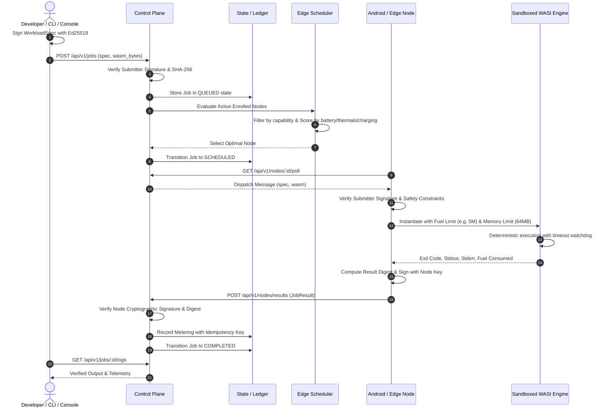

# SPaaS System Architecture

## Architectural Principles
1. **Zero Trust Mutual Isolation**: Both submitters and worker nodes are untrusted. Submitters might submit malicious bytecode (infinite loops, memory bombs, RCE attempts); nodes might return corrupted or fabricated results.
2. **Mobile First & Owner Priority**: Phones run on batteries and heat up under sustained load. The phone owner's daily experience is strictly prioritized over external compute workloads.
3. **Deterministic Sandboxing**: WebAssembly linear memory and fuel metering guarantee predictable resource consumption and reproducible execution.
4. **Transient Edge Resilience**: Edge nodes can disconnect without warning. The orchestrator never assumes persistent connectivity.

---

## Detailed Data Flow

---

## Component Topology

### Ingress Gateway (`apps/gateway`)
The boundary reverse proxy responsible for TLS termination, client rate limiting, and routing incoming traffic to the internal Control Plane.

### Control Plane (`apps/control-plane`)
The core orchestrator written in Rust on top of Axum. It maintains the authoritative state machines for nodes and jobs, orchestrates workload dispatching, enforces timeouts, and drives the autonomous reconciliation loop.

### Edge Scheduler (`crates/scheduler-core`)
A multi-criteria decision engine that evaluates battery charge, AC/wireless charging, thermal state, unmetered network transport, CPU architecture, and historical reliability to rank candidate workers.

### Workload Runtime (`crates/workload-runtime`)
The execution sandbox built on `wasmi`. It provides instruction fuel metering, memory bounds enforcement, standard I/O capture with strict quotas, and an extensible `WorkloadRuntime` trait.

### Node Agent (`crates/node-agent`)
The worker daemon that runs across Android, desktop, and server hosts. It integrates with system sensors, executes workloads inside the runtime, and triggers automatic safety yields.
