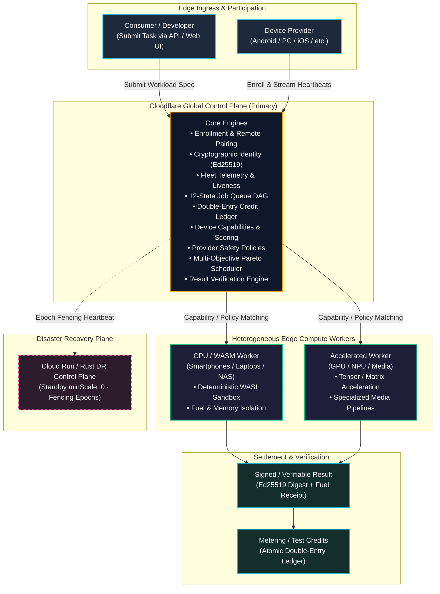
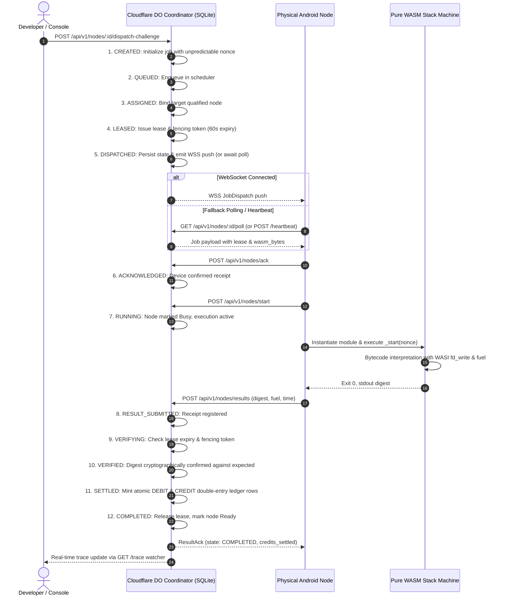

# SPaaS System Architecture

## High-Level Architecture: SPaaS Edge Compute Fabric

The SPaaS (Smartphone-as-a-Service) Universal Edge Compute Fabric unites disparate volunteer consumer hardware—ranging from physical smartphones and laptops to high-performance edge accelerators—into a unified, fault-tolerant, zero-trust compute substrate.

```
                       SPaaS EDGE COMPUTE FABRIC

       Consumer / Developer                  Device Provider
                │                                  │
                ▼                                  ▼
        ┌───────────────┐                  ┌───────────────┐
        │ Submit Task   │                  │ Android / PC  │
        │ API / Web UI  │                  │ iOS / etc.    │
        └───────┬───────┘                  └───────┬───────┘
                │                                  │
                ▼                                  ▼
     ┌─────────────────────────────────────────────────────┐
     │          Cloudflare Global Control Plane            │
     │                                                     │
     │ Enrollment │ Identity │ Fleet │ Job Queue │ Ledger │
     │ Capabilities │ Policies │ Scheduler │ Verification │
     └──────────────────────┬──────────────────────────────┘
                            │
                capability/policy matching
                            │
                ┌───────────┴───────────┐
                ▼                       ▼
         CPU/WASM Worker          Accelerated Worker
         phone / laptop          GPU / NPU / media
                │                       │
                └───────────┬───────────┘
                            ▼
                Signed/verifiable result
                            │
                            ▼
                  Metering / Test Credits

           Cloud Run / Rust DR control plane
                       standby
```

### Interactive Topology Graph


```mermaid
graph TD
    classDef actorNode fill:#1e293b,stroke:#38bdf8,stroke-width:2px,color:#f8fafc;
    classDef planeNode fill:#0f172a,stroke:#f59e0b,stroke-width:2px,color:#f8fafc;
    classDef workerNode fill:#1e1e38,stroke:#10b981,stroke-width:2px,color:#f8fafc;
    classDef standbyNode fill:#2d1b2e,stroke:#ec4899,stroke-width:2px,stroke-dasharray: 5 5,color:#f8fafc;
    classDef ledgerNode fill:#132e2b,stroke:#06b6d4,stroke-width:2px,color:#f8fafc;

    subgraph Ingress ["Edge Ingress & Participation"]
        CD["Consumer / Developer<br/>(Submit Task via API / Web UI)"]:::actorNode
        DP["Device Provider<br/>(Android / PC / iOS / etc.)"]:::actorNode
    end

    subgraph ControlPlane ["Cloudflare Global Control Plane (Primary)"]
        direction TB
        CP_CORE["Core Engines<br/>• Enrollment & Remote Pairing<br/>• Cryptographic Identity (Ed25519)<br/>• Fleet Telemetry & Liveness<br/>• 12-State Job Queue DAG<br/>• Double-Entry Credit Ledger<br/>• Device Capabilities & Scoring<br/>• Provider Safety Policies<br/>• Multi-Objective Pareto Scheduler<br/>• Result Verification Engine"]:::planeNode
    end

    subgraph ExecutionPlane ["Heterogeneous Edge Compute Workers"]
        direction LR
        W_CPU["CPU / WASM Worker<br/>(Smartphones / Laptops / NAS)<br/>• Deterministic WASI Sandbox<br/>• Fuel & Memory Isolation"]:::workerNode
        W_ACC["Accelerated Worker<br/>(GPU / NPU / Media)<br/>• Tensor / Matrix Acceleration<br/>• Specialized Media Pipelines"]:::workerNode
    end

    subgraph SettlementPlane ["Settlement & Verification"]
        RES["Signed / Verifiable Result<br/>(Ed25519 Digest + Fuel Receipt)"]:::ledgerNode
        LEDGER["Metering / Test Credits<br/>(Atomic Double-Entry Ledger)"]:::ledgerNode
    end

    subgraph DisasterRecovery ["Disaster Recovery Plane"]
        DR["Cloud Run / Rust DR Control Plane<br/>(Standby minScale: 0 · Fencing Epochs)"]:::standbyNode
    end

    CD -->|Submit Workload Spec| CP_CORE
    DP -->|Enroll & Stream Heartbeats| CP_CORE
    CP_CORE -->|Capability / Policy Matching| W_CPU
    CP_CORE -->|Capability / Policy Matching| W_ACC
    W_CPU --> RES
    W_ACC --> RES
    RES --> LEDGER
    CP_CORE -.->|Epoch Fencing Heartbeat| DR
```

### Architectural Subsystems & Flow Breakdown

1. **Consumer / Developer Ingress**:
   - **Submit Task (API / Web UI)**: Developers and end-users submit verifiable workload specifications via REST API (`POST /api/v1/jobs`), the CLI tool (`apps/cli`), or the progressive disclosure Web Console (`apps/web-console`). Workloads specify execution binaries (e.g. catalog presets or signed WASM), memory/fuel ceilings, execution deadlines, and compute categories.

2. **Device Provider Onboarding**:
   - **Android / PC / iOS / etc.**: Edge hardware owners voluntarily participate in the compute fabric. Devices enroll via zero-friction dynamic QR codes, deep links, or 6-character pairing codes over secure HTTPS.
   - Devices maintain outbound-only persistent connections (WebSocket push with authenticated fallback polling) to operate transparently behind restrictive consumer NATs and cellular CGNATs without requiring open inbound ports.

3. **Cloudflare Global Control Plane (Authoritative Primary)**:
   - Operating at Cloudflare's global edge via Workers and Durable Objects backed by co-located SQLite (`apps/cloudflare-control-plane`):
     - **Enrollment**: Manages remote pairing, challenge verification, and dynamic session token generation.
     - **Identity**: Enforces cryptographic hardware-backed identities (Android Keystore, iOS Keychain, or Ed25519 desktop keypairs) and instant revocation.
     - **Fleet**: Tracks active node liveness, battery levels, AC charging states, thermal headroom, network types, and historical reliability.
     - **Job Queue**: Drives an authoritative 12-state DAG (`SUBMITTED` → `QUEUED` → `MATCHING` → `OFFERED` → `ASSIGNED` → `LEASED` → `DOWNLOADING` → `EXECUTING` → `UPLOADING` → `VERIFYING` → `VERIFIED` → `SETTLED` → `COMPLETED`) with monotonic transitions and transition audit logs.
     - **Ledger**: Enforces double-entry credit accounting with immutable debit/credit pairings and strict idempotency.
     - **Capabilities**: Dynamically benchmarks and profiles devices via empirical challenges (e.g. MIPS throughput, RAM capacity, ISA features).
     - **Policies**: Enforces provider autonomy modes (`AUTO_ACCEPT`, `ASK_ME` with interactive 15-second prompts, `SCHEDULED_AUTO`, `PAUSED`) and safety floors (battery > 20%, thermal ceilings, unmetered Wi-Fi).
     - **Scheduler**: Executes two-phase matching—hard constraint filtering followed by multi-objective Pareto scoring with transparent explainability diagnostics (`/api/v1/jobs/:id/decision`).
     - **Verification**: Validates cryptographic execution receipts, proof-of-execution digests, fuel counters, and fencing tokens before settlement.

4. **Capability / Policy Matching**:
   - Matches incoming job requirements (architecture, memory footprint, deadline, compute category) against real-time fleet capabilities and individual provider safety rules.

5. **Worker Tiers**:
   - **CPU / WASM Worker (Smartphones / Laptops / NAS)**:
     - Pure WebAssembly stack machine or WASI runtime (`WasmRuntimeEngine.kt`, `spaas-runtime`) executing deterministically with linear memory limits (e.g. 64 MB) and instruction-level fuel metering.
     - Protects host battery and responsiveness with immediate thermal auto-pause and background/foreground service coordination.
   - **Accelerated Worker (GPU / NPU / Media)**:
     - Specialized edge devices (workstations, discrete GPUs, mobile NPUs) capable of tensor acceleration, matrix multiplication, and high-throughput media transcoding pipelines.

6. **Signed / Verifiable Result & Settlement**:
   - The executing node cryptographically signs the computed output digest, execution time, and consumed fuel using its private key (`POST /api/v1/nodes/results`).
   - The Control Plane verifies the cryptographic signature against the node's registered public key and confirms lease/fencing token validity.
   - Upon successful verification, the engine mints atomic double-entry ledger rows (DEBIT submitter, CREDIT provider) and finalizes the job to `COMPLETED`.

7. **Disaster Recovery Standby (Cloud Run / Rust)**:
   - A dormant backup orchestrator (`deploy/cloud-run`, `apps/control-plane`) running Axum Rust configured with `minScale: 0`.
   - Synchronized with the primary plane via monotonic epoch fencing tokens to guarantee split-brain prevention and seamless failover capability.

---

## Architectural Principles
1. **Zero Trust Mutual Isolation**: Both submitters and worker nodes are untrusted. Submitters might submit malicious bytecode (infinite loops, memory bombs, RCE attempts); nodes might return corrupted or fabricated results.
2. **Mobile First & Owner Priority**: Phones run on batteries and heat up under sustained load. The phone owner's daily experience is strictly prioritized over external compute workloads.
3. **Deterministic Sandboxing**: WebAssembly linear memory and fuel metering guarantee predictable resource consumption and reproducible execution across physical mobile devices.
4. **Transient Edge Resilience**: Edge nodes can disconnect without warning. The orchestrator never assumes persistent connectivity.

---

## Detailed Data Flow & Authoritative Lifecycle


```mermaid
sequenceDiagram
    autonumber
    actor Developer as Developer / Console
    participant CF as Cloudflare DO Coordinator (SQLite)
    participant Android as Physical Android Node
    participant Wasm as Pure WASM Stack Machine

    Developer->>CF: POST /api/v1/nodes/:id/dispatch-challenge
    CF->>CF: 1. CREATED: Initialize job with unpredictable nonce
    CF->>CF: 2. QUEUED: Enqueue in scheduler
    CF->>CF: 3. ASSIGNED: Bind target qualified node
    CF->>CF: 4. LEASED: Issue lease & fencing token (60s expiry)
    CF->>CF: 5. DISPATCHED: Persist state & emit WSS push (or await poll)
    
    alt WebSocket Connected
        CF-->>Android: WSS JobDispatch push
    else Fallback Polling / Heartbeat
        Android->>CF: GET /api/v1/nodes/:id/poll (or POST /heartbeat)
        CF-->>Android: Job payload with lease & wasm_bytes
    end

    Android->>CF: POST /api/v1/nodes/ack
    CF->>CF: 6. ACKNOWLEDGED: Device confirmed receipt
    Android->>CF: POST /api/v1/nodes/start
    CF->>CF: 7. RUNNING: Node marked Busy, execution active
    
    Android->>Wasm: Instantiate module & execute _start(nonce)
    Wasm->>Wasm: Bytecode interpretation with WASI fd_write & fuel
    Wasm-->>Android: Exit 0, stdout digest
    
    Android->>CF: POST /api/v1/nodes/results (digest, fuel, time)
    CF->>CF: 8. RESULT_SUBMITTED: Receipt registered
    CF->>CF: 9. VERIFYING: Check lease expiry & fencing token
    CF->>CF: 10. VERIFIED: Digest cryptographically confirmed against expected
    CF->>CF: 11. SETTLED: Mint atomic DEBIT & CREDIT double-entry ledger rows
    CF->>CF: 12. COMPLETED: Release lease, mark node Ready
    CF-->>Android: ResultAck (state: COMPLETED, credits_settled)
    CF-->>Developer: Real-time trace update via GET /trace watcher
```

---

## Component Topology

### Cloudflare Edge Control Plane (`apps/cloudflare-control-plane`)
- **Ingress Gateway (`src/index.js`)**: Public edge reverse proxy handling CORS, APK downloads, and forwarding to Durable Objects.
- **Durable Object Coordinator (`src/coordinator.js`)**: Authoritative single-writer cluster coordinator backed by co-located SQLite. Manages node sessions, lease reconciliation alarms, rate limiting, and dual-entry ledger settlement.
- **SQLite Bridge (`src/sqlite-bridge.js`)**: High-performance SQLite abstraction layer supporting ACID transactions, job transition logs, and device session hibernation.

### Physical Android Node (`apps/android-node`)
- **Compute Foreground Service (`ComputeForegroundService.kt`)**: Android foreground service managing persistent lifecycle, sticky notification state, and battery/thermal safety policies.
- **Compute Worker Client (`ComputeWorkerClient.kt`)**: Network orchestrator supporting dual-path dispatch (WebSocket push notification with authenticated poll fallback every 2s).
- **WASM Runtime Engine (`WasmRuntimeEngine.kt`)**: Pure stack-machine WebAssembly bytecode interpreter executing WASI Preview 1 host calls (`args_get`, `clock_time_get`, `fd_write`, etc.), linear memory operations, and 64-bit integer arithmetic with zero native fallback shortcuts.

### Web Console (`apps/web-console`)
- **Frontend Dashboard (`src/main.js`, `index.html`)**: Reactive SPA deployed to Cloudflare Pages (`spaas-console.pages.dev`). Features a live 10-step lifecycle trace watcher (`/api/v1/jobs/:id/trace`), device qualification monitor, dynamic QR enrollment, and downloadable double-entry ledger.

### Disaster Recovery Standby (`deploy/cloud-run`, `apps/control-plane`)
- **Google Cloud Run Rust Standby**: Dormant backup orchestrator (`minScale: 0`) designed for cross-cloud disaster recovery failover via signed epoch fencing tokens. Does not participate in active scheduling while Cloudflare DO is primary.
