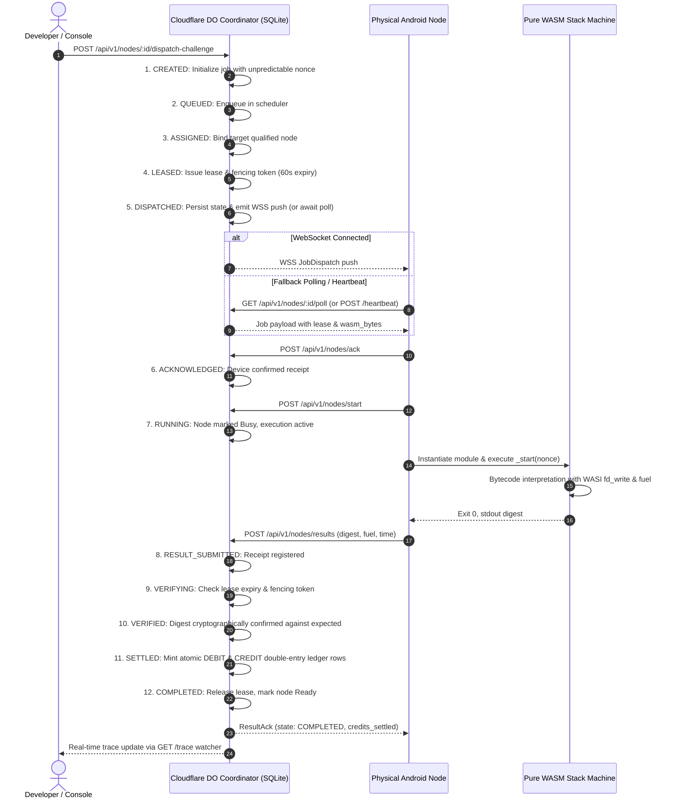

# SPaaS System Architecture

## Architectural Principles
1. **Zero Trust Mutual Isolation**: Both submitters and worker nodes are untrusted. Submitters might submit malicious bytecode (infinite loops, memory bombs, RCE attempts); nodes might return corrupted or fabricated results.
2. **Mobile First & Owner Priority**: Phones run on batteries and heat up under sustained load. The phone owner's daily experience is strictly prioritized over external compute workloads.
3. **Deterministic Sandboxing**: WebAssembly linear memory and fuel metering guarantee predictable resource consumption and reproducible execution across physical mobile devices.
4. **Transient Edge Resilience**: Edge nodes can disconnect without warning. The orchestrator never assumes persistent connectivity.

---

## Detailed Data Flow & Authoritative Lifecycle

```mermaid
sequenceDiagram
    autonumber
    actor Developer as Developer / Console
    participant CF as Cloudflare DO Coordinator (SQLite)
    participant Android as Physical Android Node
    participant Wasm as Pure WASM Stack Machine

    Developer->>CF: POST /api/v1/nodes/:id/dispatch-challenge
    CF->>CF: 1. CREATED: Initialize job with unpredictable nonce
    CF->>CF: 2. QUEUED: Enqueue in scheduler
    CF->>CF: 3. ASSIGNED: Bind target qualified node
    CF->>CF: 4. LEASED: Issue lease & fencing token (60s expiry)
    CF->>CF: 5. DISPATCHED: Persist state & emit WSS push (or await poll)
    
    alt WebSocket Connected
        CF-->>Android: WSS JobDispatch push
    else Fallback Polling / Heartbeat
        Android->>CF: GET /api/v1/nodes/:id/poll (or POST /heartbeat)
        CF-->>Android: Job payload with lease & wasm_bytes
    end

    Android->>CF: POST /api/v1/nodes/ack
    CF->>CF: 6. ACKNOWLEDGED: Device confirmed receipt
    Android->>CF: POST /api/v1/nodes/start
    CF->>CF: 7. RUNNING: Node marked Busy, execution active
    
    Android->>Wasm: Instantiate module & execute _start(nonce)
    Wasm->>Wasm: Bytecode interpretation with WASI fd_write & fuel
    Wasm-->>Android: Exit 0, stdout digest
    
    Android->>CF: POST /api/v1/nodes/results (digest, fuel, time)
    CF->>CF: 8. RESULT_SUBMITTED: Receipt registered
    CF->>CF: 9. VERIFYING: Check lease expiry & fencing token
    CF->>CF: 10. VERIFIED: Digest cryptographically confirmed against expected
    CF->>CF: 11. SETTLED: Mint atomic DEBIT & CREDIT double-entry ledger rows
    CF->>CF: 12. COMPLETED: Release lease, mark node Ready
    CF-->>Android: ResultAck (state: COMPLETED, credits_settled)
    CF-->>Developer: Real-time trace update via GET /trace watcher
```

---

## Component Topology

### Cloudflare Edge Control Plane (`apps/cloudflare-control-plane`)
- **Ingress Gateway (`src/index.js`)**: Public edge reverse proxy handling CORS, APK downloads, and forwarding to Durable Objects.
- **Durable Object Coordinator (`src/coordinator.js`)**: Authoritative single-writer cluster coordinator backed by co-located SQLite. Manages node sessions, lease reconciliation alarms, rate limiting, and dual-entry ledger settlement.
- **SQLite Bridge (`src/sqlite-bridge.js`)**: High-performance SQLite abstraction layer supporting ACID transactions, job transition logs, and device session hibernation.

### Physical Android Node (`apps/android-node`)
- **Compute Foreground Service (`ComputeForegroundService.kt`)**: Android foreground service managing persistent lifecycle, sticky notification state, and battery/thermal safety policies.
- **Compute Worker Client (`ComputeWorkerClient.kt`)**: Network orchestrator supporting dual-path dispatch (WebSocket push notification with authenticated poll fallback every 2s).
- **WASM Runtime Engine (`WasmRuntimeEngine.kt`)**: Pure stack-machine WebAssembly bytecode interpreter executing WASI Preview 1 host calls (`args_get`, `clock_time_get`, `fd_write`, etc.), linear memory operations, and 64-bit integer arithmetic with zero native fallback shortcuts.

### Web Console (`apps/web-console`)
- **Frontend Dashboard (`src/main.js`, `index.html`)**: Reactive SPA deployed to Cloudflare Pages (`spaas-console.pages.dev`). Features a live 10-step lifecycle trace watcher (`/api/v1/jobs/:id/trace`), device qualification monitor, dynamic QR enrollment, and downloadable double-entry ledger.

### Disaster Recovery Standby (`deploy/cloud-run`, `apps/control-plane`)
- **Google Cloud Run Rust Standby**: Dormant backup orchestrator (`minScale: 0`) designed for cross-cloud disaster recovery failover via signed epoch fencing tokens. Does not participate in active scheduling while Cloudflare DO is primary.
