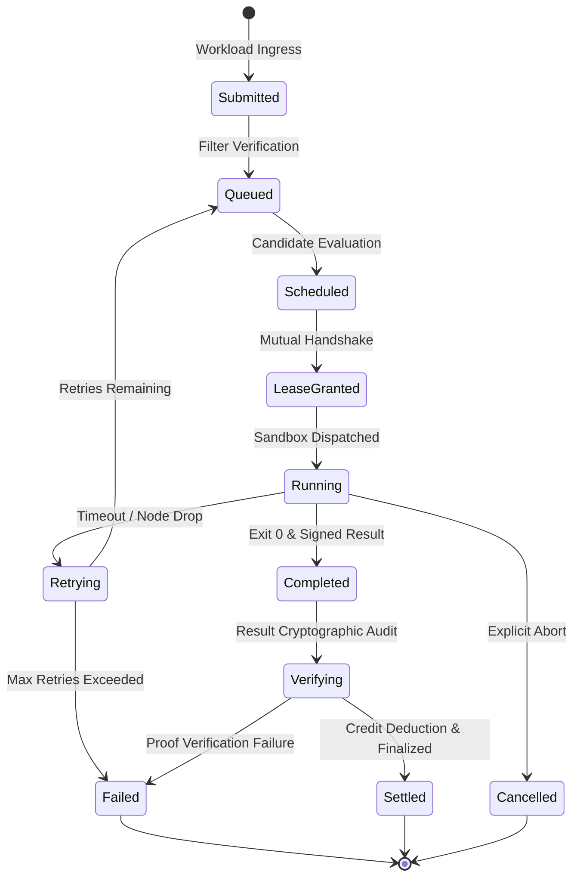

# SPaaS Protocol & RPC Specification

## 1. Transport & Wire Formats

The SPaaS Universal Edge Compute Fabric uses standard HTTP/1.1 and HTTP/2 transports with JSON serialization (RFC 8259) and Server-Sent Events (SSE) for real-time bidirectional telemetry streaming.

### Binary Data Encoding
- **WebAssembly Binaries**: Encoded in standard RFC 4648 Base64 strings within the `wasm_binary_base64` property.
- **Cryptographic Signatures & Public Keys**: Encoded in Base64 or hex format with canonical Ed25519 semantics.
- **Content-Type**: `application/json` for REST RPCs; `text/event-stream` for live SSE cluster events.

---

## 2. Core Protocol State Machines

### 2.1 Job Execution Lifecycle (10 Deterministic Phases)



### 2.2 Node Lifecycle State Machine
- **`Idle`**: Node is connected, healthy, passing thermal/battery policies, and awaiting workload lease.
- **`Active`**: Node is currently executing a leased sandboxed WebAssembly job.
- **`Paused`**: Compute suspended due to local safety policy breaches (e.g. battery < 20%, phone unplugged, on cellular data).
- **`Offline`**: Node missed heartbeats beyond `heartbeat_timeout_ms` (10s); leases revoked and active jobs rescheduled.
- **`Unenrolled`**: Node explicitly retired or removed by its provider.

---

## 3. Protocol Message Schemas

### 3.1 Node Registration (`POST /api/v1/nodes/register`)
Registers a new edge node with its cryptographic public key and hardware capabilities:

```json
{
  "node_id": "node-android-pixel8-7f2a",
  "public_key": "MCowBQYDK2VwAyEAX... (Ed25519 Base64)",
  "hardware_profile": {
    "architecture": "aarch64",
    "cpu_cores": 8,
    "total_ram_mb": 8192,
    "os_version": "Android 15 (API 35)",
    "device_model": "Pixel 8 Pro",
    "device_type": "Phone"
  },
  "qualification": {
    "measured_fuel_mips": 185.4,
    "sustained_throttling_ratio": 0.88,
    "network_latency_ms": 14.2,
    "energy_efficiency_score": 92
  },
  "initial_policy": {
    "require_charging": true,
    "require_unmetered_network": true,
    "min_battery_pct": 30,
    "max_thermal_level": "MODERATE"
  }
}
```

### 3.2 Periodic Node Heartbeat (`POST /api/v1/nodes/:id/heartbeat`)
Heartbeats maintain node liveness, stream current battery/thermal metrics, and receive remote control commands:

```json
{
  "node_id": "node-android-pixel8-7f2a",
  "battery_pct": 82,
  "is_charging": true,
  "thermal_state": "NOMINAL",
  "is_unmetered": true,
  "current_job_id": null,
  "timestamp_ms": 1727350000000
}
```

**Heartbeat Response Payload:**
```json
{
  "acknowledged": true,
  "assigned_job": {
    "job_id": "job-wasm-primes-9c41",
    "lease_id": "lease-88b1f",
    "lease_expiry_ms": 1727350030000,
    "workload_spec": { ... }
  },
  "remote_commands": [
    { "type": "ReEnumerateCapabilities" }
  ]
}
```

### 3.3 Workload Submission (`POST /api/v1/jobs`)
Submitted by consumers or developers to dispatch a sandboxed task:

```json
{
  "spec": {
    "workload_id": "uuid-v4",
    "spec_version": "1.0.0",
    "name": "edge-prime-sieve",
    "runtime": "wasm_wasi",
    "entrypoint": "_start",
    "limits": {
      "max_fuel": 10000000,
      "max_memory_bytes": 16777216,
      "timeout_ms": 15000
    },
    "preferred_regions": ["us-west", "us-east"],
    "category": "computation",
    "max_cost_credits": 250,
    "required_capabilities": {
      "architectures": ["aarch64", "x86_64"],
      "min_ram_mb": 256,
      "require_charging": true
    },
    "submitter_pubkey": "consumer-ed25519-abc1234",
    "submitter_signature": "sig-base64"
  },
  "wasm_binary_base64": "AGFzbQEAAAABBQFgAAF..."
}
```

---

## 4. Error Handling & Protocol Status Codes

| HTTP Status | Error Identifier | Description |
|---|---|---|
| `400 Bad Request` | `INVALID_PAYLOAD` | Malformed JSON or invalid WebAssembly binary magic header. |
| `401 Unauthorized` | `INVALID_AUTH_TOKEN` | Missing or invalid Bearer token when auth middleware is active. |
| `404 Not Found` | `NODE_NOT_FOUND` / `JOB_NOT_FOUND` | Queried node or job identifier does not exist in cluster state. |
| `409 Conflict` | `IDEMPOTENCY_COLLISION` | Duplicate submission with mutated payload under the same idempotency key. |
| `429 Too Many Requests`| `RATE_LIMITED` | Ingress request rate exceeds configured token bucket capacity. |
| `503 Unavailable` | `NO_FEASIBLE_NODES` | No active registered node meets the workload's hardware constraints. |
